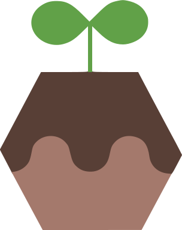

# 비 온 뒤 단단해지는 땅처럼

## 🌱Introduce

### 세션 소개
> **비 온 뒤 단단해지는 땅처럼: 신입 개발자들의 학습과 성장 이야기**는, 개발을 시작하던 때 학습에 대한 막막함과 막연함을 아직 기억하고 그 다음 단계를 밟고 있는 사람들이 *"이걸 알았더라면 좋았을텐데..."* 싶었던 점들을 공유하는 토크쇼 세션입니다.

### 연사자 소개
<table>
  <td>이름을 누르면 깃허브 프로필로 이동해요!</td>
</table>

- [😹여다희](https://github.com/yeodahui) : 세션 진행자, 지방에서 컴퓨터공학과를 재학중인 여다희입니다. 
- [💘임현지](https://github.com/usablepaper) : 문제를 해결하는 게 너무 짜릿한 개발자 임현지입니다.  잘 부탁드립니다.
- [🥰유준상](https://github.com/YOOJS1205) : 지식 및 경험 공유를 좋아하고, 산업공학과에 재학중인 유준상입니다. 
- [💙조민경](https://github.com/minkyeongJ) : 사람을 좋아하고 심리학을 전공한 개발자 조민경입니다! 이번 시간 즐기셨으면 좋겠어요ㅎㅎ
- [👻김미리](https://github.com/ThisisMiri) : 스스로를 되돌아보고, 더 나은 방법과 커뮤니케이션에 대해 고민하는 개발자입니다!
- [🙉류재준](https://github.com/ryungom) : 미대출신의 전직 퍼블리셔, 개발자 류재준입니다! 우리들의 잘 다져진 땅을 지켜봐주세요
- [🥳전서희](https://github.com/SeoHee3478) : UX디자인을 공부하다가 코딩에 매력을 느껴 개발에 입문한 전서희입니다!
- [🤫황혜명](https://github.com/CosmicLatte009) : 주니어 중의 주니어 개발자 황혜명입니다. 오늘 편한 시간 되세요~!

 

## 📚 목차
  ### 1. 학습방법
  - Q1. 개발자가 되기 위해 뭐부터 공부해야 할 지 모르겠어요. &nbsp;( `여다희` , `김미리` )
  - Q2. 내가 했던 학습방법 중 '이건 효과가 정말 좋았다' 라고 생각하는 방법은? &nbsp;( `유준상` , `임현지` )
  - Q3. 내가 했던 학습방법 중 '이건 별로였다' 라고 생각하는 방법은? &nbsp;( `유준상` , `전서희` )
  - Q4. 내가 했던 학습방법 중 '이건 효과가 정말 좋았다' 라고 생각하는 방법은? &nbsp;( `여다희` , `류재준` )
  - Q5. 스터디를 어떻게 시작해야 할까요? &nbsp;( `김미리` , `조민경` , `황혜명` ) 

  ### 2. 학습 태도
  - Q1. 피드백이 무서워요. &nbsp;( `여다희` , `유준상` )
  - Q2. 나보다 앞서가는 사람이 보이면 불안해요. &nbsp;( `임현지` )
  - Q3. 개발자가 적성에 안맞는것 같고 너무 어려워요. 제가 개발과 맞는 사람일까요? &nbsp;( `조민경` , `류재준` )
  - Q4. 번아웃이 온 적이 있나요? 어떻게 극복하셨나요? &nbsp;( `전서희` , `조민경` , `황혜명` )
  - Q5. 해야할게 많아져서 마음이 조급해집니다. 혹시 이런 조급한 마음을 다스릴 좋은 방법이 있을까요? &nbsp;( `김미리` , `여다희` ) 

  ### 3. 정보와 팁
  - Q1. 부트캠프에 들어가기 전에 무엇을 준비하면 좋을까요? &nbsp;( `임현지` , `황혜명` )
  - Q2. 개발 관련 정보는 어디서 얻을 수 있을까요? &nbsp;( `여다희` , `류재준` )
